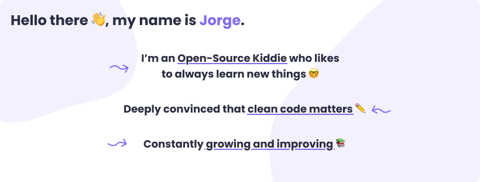

<main style="color: #2B2D42; text-align: center; width: 820px; padding: 2rem; box-sizing: border-box; background-color: #F3F1FE; border-radius: 8px; display: flex; flex-direction: column; align-items: center;">
<h2 style="color: inherti; font-weight: bold;"> Currently Working on: </h2>

Miru – Anime Searcher 🔎

</main>